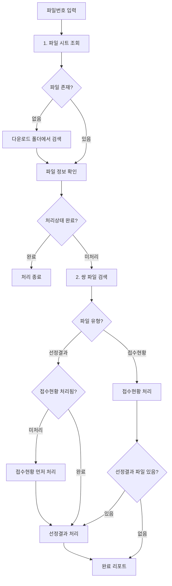

# /update 스킬 실행 흐름 가이드

이 문서는 `/update` 스킬의 실제 실행 흐름과 주요 처리 로직을 설명합니다.

> **참고**: 명령어 스펙은 [.claude/commands/update.md](.claude/commands/update.md) 참조

---

## 📋 목차

1. [전체 실행 흐름](#전체-실행-흐름)
2. [단계별 상세 설명](#단계별-상세-설명)
3. [주요 처리 로직](#주요-처리-로직)
4. [예외 상황 처리](#예외-상황-처리)
5. [실제 처리 예시](#실제-처리-예시)

---

## 전체 실행 흐름



---

## 단계별 상세 설명

### Step 1: 파일 정보 조회 및 검증

#### 1.1 파일 시트에서 조회

```javascript
// 파일 시트에서 파일번호로 검색
const files = await sheets.getAllRows('파일');
const file = files.find(f => f['파일번호'] === fileNumber);
```

**확인 사항:**
- 파일 ID (FH0001, FH0002 등)
- 파일 유형 (접수현황 / 선정결과)
- 처리 상태 (처리중 / 완료)
- 연결된 출자사업 ID

#### 1.2 다운로드 폴더 검증

```bash
# downloads 폴더에서 실제 파일 확인
ls -la downloads/ | grep -i "${fileNumber}"
```

**중요**: 파일 시트에 없으면 직접 다운로드 폴더에서 찾아서 처리

#### 1.3 중복 체크

**파일번호 중복 문제 예시:**
```text
행2:  ID=FH0001, 파일번호=4660, 파일명=4116_중기부...  ← 잘못됨
행201: ID=FH0001, 파일번호=4660, 파일명=4660_부산...  ← 올바름
```

**해결 방법:**
1. 파일명과 파일번호 일치 확인
2. 불일치 시 파일번호 수정
3. 중복 ID인 경우 새 ID 부여

---

### Step 2: 쌍 파일 검색 및 출자사업 확인

#### 2.1 사업명 추출

```javascript
// PDF 읽어서 사업명 추출
const pdfContent = await readPDF(filePath);
const projectName = extractProjectName(pdfContent);
// 예: "부산 혁신 스케일업 벤처펀드 2025년 출자사업"
```

#### 2.2 반대 유형 파일 검색

```javascript
const oppositeType = fileType === '접수현황' ? '선정결과' : '접수현황';
const pairFile = files.find(f =>
  f['파일유형'] === oppositeType &&
  matchProjectName(f['파일명'], projectName)
);
```

**매칭 조건:**
- 연도 일치 (2024, 2025)
- 소관 일치 (중기부, 부산, 문체부)
- 차수 일치 (1차, 2차, 수시)
- 키워드 일치 (혁신, 스케일업 등)

#### 2.3 출자사업 확인/생성

```javascript
// 기존 출자사업 검색
let project = projects.find(p => p['사업명'] === projectName);

if (!project) {
  // 신규 생성
  project = await sheets.getOrCreateProject(projectName, {
    소관: '부산',
    공고유형: '정시',
    연도: '2025',
    차수: '1차'
  });
}
```

**중복 출자사업 처리:**
- 같은 사업명이 여러 개 있으면 파일 연결 상태 확인
- 빈 출자사업(신청현황 0건)은 삭제 대상
- 파일이 이미 연결된 출자사업을 우선 사용

---

### Step 3: 파일 분석 (이중 파싱)

#### 3.1 Claude Code 직접 분석

```javascript
// Read 도구로 PDF 읽기
const pdfContent = await Read(pdfFilePath);

// 수동 파싱
const claudeResults = parsePDFManually(pdfContent);
// 결과:
// - 운용사명 목록
// - 출자분야
// - 금액 (결성예정액, 출자요청액)
// - 공동GP 여부 판단
```

**장점**:
- PDF 구조가 복잡해도 정확히 이해
- 공동GP 판단 정확도 높음
- 셀 병합, 특수 레이아웃 처리 가능

#### 3.2 pdfplumber 파싱

```bash
python3 src/processors/pdf-parser.py "downloads/파일명.pdf"
```

**출력 형식:**
```json
{
  "type": "application",
  "total_funds": 16,
  "total_operators": 20,
  "applications": [
    {
      "category": "라이콘",
      "company": "어번데일벤처스",
      "amount_planned": 51.0,
      "amount_requested": 35.0,
      "is_joint_gp": false
    },
    {
      "category": "AC",
      "company": "부산창조경제혁신센터",
      "is_joint_gp": true,
      "original_company": "부산창조경제혁신센터\n한국사회투자"
    }
  ]
}
```

**장점**:
- 표 구조 자동 인식
- 빠른 처리 속도
- 금액 필드 자동 추출

#### 3.3 결과 비교 및 병합

```javascript
const comparison = compareResults(claudeResults, pdfplumberResults);

// 비교 규칙:
// 1. 양쪽 모두 있음 → 운용사명, 분야 일치 확인
// 2. Claude만 있음 → 포함 (정확도 높음)
// 3. pdfplumber만 있음 → 무시 (노이즈)
// 4. 공동GP 판단 다름 → 사용자에게 질문
```

**공동GP 충돌 처리:**
```text
pdfplumber: is_joint_gp=true, "A\nB"
Claude: A (개별), B (개별)

→ 사용자에게 질문: "PDF에서 A, B가 같은 셀에 있나요?"
→ 답변에 따라 공동GP 또는 개별로 처리
```

---

### Step 4: 운용사 매칭 (유사도 검사)

#### 4.1 기존 운용사 조회

```javascript
const operators = await sheets.getAllOperators();

for (const parsedName of parsedOperators) {
  const matches = findSimilarOperators(parsedName, operators);
  // 반환: [{ id, name, score, coreScore }]
}
```

#### 4.2 유사도 판단 로직

```javascript
function decideSimilarity(parsedName, match) {
  // 1. 정확히 일치
  if (match.score === 1.0) {
    return { useExisting: true, id: match.id };
  }

  // 2. 법인 표기 차이만
  if (isOnlyLegalDifference(parsedName, match.name)) {
    return { useExisting: true, id: match.id };
  }

  // 3. 유사도 85% 미만 → 신규
  if (match.score < 0.85) {
    return { createNew: true };
  }

  // 4. 유사도 85% 이상 + 핵심명 60% 미만 → 신규 (접미사만 유사)
  if (match.score >= 0.85 && match.coreScore < 0.6) {
    return { createNew: true };
  }

  // 5. 유사도 85% 이상 + 핵심명 60% 이상 → 사용자 확인
  return { askUser: true, match };
}
```

#### 4.3 자동 처리 vs 질문

**자동 처리:**
```text
- "KB인베스트먼트" vs "케이비인베스트먼트" → 같은 회사 (영문↔한글)
- "벤처투자" vs "(주)벤처투자" → 같은 회사 (법인 표기)
- "A인베스트먼트" vs "B인베스트먼트" → 다른 회사 (핵심명 다름)
```

**사용자 질문:**
```text
- "아이비케이캐피탈" vs "IBK벤처투자"
  → 유사도 90%, 핵심명 70% → 웹검색으로 확인 필요
```

---

### Step 5: 데이터 저장

#### 5.1 접수현황 파일 처리

**흐름:**
```text
1. 신규 운용사 일괄 등록 (createOperatorsBatch)
2. 기존 신청현황 조회 (중복 방지)
3. 신청현황 데이터 준비 (상태: "접수")
4. 일괄 생성 (createApplicationsBatch)
5. 파일 현황 업데이트
```

**코드 예시:**
```javascript
// 1. 신규 운용사 일괄 등록
const newOperators = ['운용사A', '운용사B', '운용사C'];
const nameToIdMap = await sheets.createOperatorsBatch(newOperators);
// 반환: Map { '운용사A' => 'OP0500', '운용사B' => 'OP0501', ... }

// 2. 신청현황 데이터 준비
const applicationsToCreate = [];
for (const item of parsedData) {
  const operatorId = nameToIdMap.get(item.companyName);
  const key = `${operatorId}|${item.category}`;

  // 중복 체크
  if (existingApps.has(key)) continue;

  applicationsToCreate.push({
    출자사업ID: 'PJ0041',
    운용사ID: operatorId,
    출자분야: item.category,
    상태: '접수',
    비고: item.isJointGP ? '공동GP' : ''
  });
}

// 3. 일괄 생성
const newIds = await sheets.createApplicationsBatch(applicationsToCreate);
console.log(`신청현황 ${newIds.length}건 생성`);
```

**중복 방지 로직:**
```javascript
// 출자사업ID + 운용사ID + 출자분야 조합으로 중복 체크
const existingApps = await sheets.getExistingApplications(projectId);
// 반환: Map { 'OP0001|중진-루키리그' => { appId: 'AP0001', status: '접수' } }

const key = `${operatorId}|${category}`;
if (existingApps.has(key)) {
  console.log('중복 스킵:', key);
  continue;
}
```

#### 5.2 선정결과 파일 처리

**흐름:**
```text
1. 출자사업의 모든 신청현황 조회
2. 선정 운용사 목록 추출 (PDF 파싱)
3. 선정 여부에 따라 상태 업데이트
   - 선정 목록에 있음 → "선정"
   - 선정 목록에 없음 → "탈락"
4. 파일 현황 동기화
```

**코드 예시:**
```javascript
// 1. 기존 신청현황 조회
const apps = await sheets.getAllRows('신청현황');
const projectApps = apps.filter(a => a['출자사업ID'] === 'PJ0041');

// 2. 선정 운용사 ID 목록
const selectedIds = ['AP1568', 'AP1569', 'AP1575', 'AP1576'];

// 3. 상태 업데이트
for (const app of projectApps) {
  const newStatus = selectedIds.includes(app['ID']) ? '선정' : '탈락';

  if (app['상태'] !== newStatus) {
    await sheets.setValues(`신청현황!J${app._rowIndex}`, [[newStatus]]);
    console.log(`[${newStatus}] ${app['ID']}`);
  }
}
```

#### 5.3 약어 자동 업데이트

**시나리오:**
```text
접수현황 PDF: "아이비케이캐피탈"
선정결과 PDF: "IBK캐피탈"

→ 유사도 매칭으로 같은 운용사 (OP0034)로 판단
→ 약어 필드에 "아이비케이캐피탈", "IBK캐피탈" 모두 추가
→ 다음번 검색 시 두 표기 모두 자동 매칭됨
```

**코드:**
```javascript
if (matchedOperator && matchedOperator.name !== parsedName) {
  await sheets.updateOperatorAlias(matchedOperator.id, parsedName);
  console.log(`약어 추가: ${matchedOperator.id} - ${parsedName}`);
}
```

---

### Step 6: 현황 동기화

#### 6.1 파일 현황 동기화 (CRITICAL)

**⚠️ 절대 파싱 결과로 직접 저장하지 말 것!**

```javascript
// ❌ 잘못된 방법 (파싱 결과 직접 저장)
await sheets.setValues(`파일!I${fileRow}`, [[`총 20개 중 선정 6건`]]);

// ✅ 올바른 방법 (신청현황에서 계산)
await sheets.syncFileStatusWithApplications(fileId);
// → 신청현황 테이블에서 실제 건수 계산하여 저장
```

**이유:**
- 파싱 중 중복 스킵된 건 제외
- 공동GP 분리로 건수 증가
- 실제 DB와 파일 현황이 다를 수 있음

**syncFileStatusWithApplications 로직:**
```javascript
async syncFileStatusWithApplications(fileId) {
  // 1. 파일이 연결된 출자사업 찾기
  const projectId = findProjectByFile(fileId);

  // 2. 출자사업의 신청현황 조회
  const apps = await getApplicationsByProject(projectId);

  // 3. 통계 계산
  const total = apps.length;
  const selected = apps.filter(a => a.status === '선정').length;

  // 4. 파일 현황 업데이트
  const status = `총 ${total}개 중 선정 ${selected}건`;
  await updateFileStatus(fileId, status);
}
```

#### 6.2 출자사업 현황 업데이트

```javascript
await sheets.updateProjectStatus(projectId);
// → "총 20건 (선정 6, 탈락 14)"
```

---

## 주요 처리 로직

### 1. 공동GP 분리 로직

**입력:**
```text
"부산창조경제혁신센터, 한국사회투자"
```

**처리:**
```javascript
const companies = splitJointGP(original);
// 결과: ['부산창조경제혁신센터', '한국사회투자']

// 각각 개별 신청현황 생성
for (const company of companies) {
  await createApplication({
    운용사명: company,
    출자분야: 'AC',
    비고: '공동GP'
  });
}
```

**구분자:**
- `/` (슬래시)
- `,` (쉼표)
- `\n` (줄바꿈 - pdfplumber 파싱 시)

### 2. 금액 필드 파싱

**원화:**
```text
"300억원" → 300 (숫자), "억원" (통화단위)
"243.35억" → 243.35, "억원"
```

**달러:**
```text
"USD 50M" → 50, "USD(M)"
"$100M" → 100, "USD(M)"
```

### 3. 출자분야 형식 통일

**입력 (PDF):**
```text
"중진-루키리그"
"중진 루키리그"
"청년/청년창업"
```

**출력 (DB):**
```text
"중진 - 루키리그"
"청년 - 청년창업"
```

**정규화 규칙:**
- 계정과 분야 사이: ` - ` (공백-대시-공백)
- 슬래시/하이픈 → 대시로 통일

---

## 예외 상황 처리

### 1. 파일번호 중복

**상황:**
```text
FH0001: 파일번호=4660, 파일명=4116_중기부...  ← 오류
FH0001: 파일번호=4660, 파일명=4660_부산...    ← 오류
```

**해결:**
```javascript
// 1. 파일명에서 실제 파일번호 추출
const actualNumber = extractFileNumber(fileName);

// 2. 불일치 시 수정
if (fileNumber !== actualNumber) {
  await sheets.setValues(`파일!C${row}`, [[actualNumber]]);
}

// 3. 중복 ID 수정
const lastId = getLastFileId(); // FH0119
const newId = incrementId(lastId); // FH0120
await sheets.setValues(`파일!A${row}`, [[newId]]);
```

### 2. 중복 출자사업

**상황:**
```text
PJ0041: 부산 혁신 스케일업 벤처펀드 2025년 출자사업 (신청현황 20건)
PJ0045: 부산 혁신 스케일업 벤처펀드 2025년 (신청현황 0건) ← 중복
```

**해결:**
```javascript
// 1. 신청현황 0건인 출자사업 찾기
const emptyProject = projects.find(p =>
  p.name === targetName &&
  getApplicationCount(p.id) === 0
);

// 2. 삭제
if (emptyProject) {
  await sheets.deleteRow('출자사업', emptyProject._rowIndex);
  console.log(`중복 출자사업 삭제: ${emptyProject.id}`);
}
```

### 3. 파일 중복 연결 오류

**오류 메시지:**
```text
Error: 파일 중복 연결 오류: FH0074는 이미 PJ0041에 연결됨.
현재 시도: PJ0045
```

**원인:**
- 중복 출자사업에 파일 연결 시도
- 파일-출자사업 매칭 오류

**해결:**
```javascript
// 1. 기존 연결 확인
const linkedProject = findProjectByFile(fileId);

// 2. 기존 출자사업 사용
if (linkedProject) {
  console.log(`파일이 이미 ${linkedProject.id}에 연결됨`);
  projectId = linkedProject.id; // 기존 출자사업 사용
}
```

### 4. API 할당량 초과

**증상:**
```text
Error: Quota exceeded for quota metric 'Read requests' and limit...
```

**자동 재시도:**
```javascript
async function retryWithBackoff(fn, maxRetries = 3) {
  for (let i = 0; i < maxRetries; i++) {
    try {
      return await fn();
    } catch (err) {
      if (err.code === 429 && i < maxRetries - 1) {
        console.log(`API 할당량 초과, 60초 대기 후 재시도 (${i+1}/${maxRetries})`);
        await sleep(60000);
      } else {
        throw err;
      }
    }
  }
}
```

---

## 실제 처리 예시

### 예시 1: 접수현황 + 선정결과 연속 처리

**명령:**
```bash
/update 4660
```

**실행 과정:**

```text
[1] 파일 정보 조회
    - 파일번호: 4660
    - 파일명: 부산_혁신_스케일업_벤처펀드_2025년_선정_결과.pdf
    - 파일 유형: 선정결과

[2] 쌍 파일 검색
    - 접수현황 파일 검색: 4616 발견
    - 상태 확인: 완료 ✓

[3] 출자사업 확인
    - 파일 4616이 PJ0041에 연결됨
    - PJ0041 사용

[4] 선정결과 파일 분석
    - Claude 분석: 6개 운용사 선정
    - pdfplumber 파싱: 8개 항목 (노이즈 2개)
    - 비교 후 6개 확정

[5] 운용사 매칭
    - 부산창조경제혁신센터 → OP0355 (기존)
    - 한국사회투자 → OP0127 (기존)
    - 제피러스랩 → OP0134 (기존)
    - 비엔케이벤처투자 → OP0472 (기존)
    - 나우아이비캐피탈 → OP0002 (기존)
    - 인라이트벤처스 → OP0087 (기존)

[6] 상태 업데이트
    - PJ0041 신청현황 20건 조회
    - 선정 6건 → "선정"
    - 나머지 14건 → "탈락"

[7] 현황 동기화
    - 파일 FH0120: "총 20개 중 선정 6건"
    - 출자사업 PJ0041: "총 20건 (선정 6, 탈락 14)"

[8] 완료
    ✅ 선정 6건 업데이트
    ✅ 탈락 14건 업데이트
```

### 예시 2: 접수현황 처리 (선정결과 미처리)

**명령:**
```bash
/update 4616
```

**실행 과정:**

```text
[1] 파일 정보 조회
    - 파일번호: 4616
    - 파일 유형: 접수현황
    - 처리상태: 미처리

[2] 출자사업 생성
    - 사업명: 부산 혁신 스케일업 벤처펀드 2025년 출자사업
    - PJ0041 생성

[3] 파일 분석
    - 신청조합 16개
    - 공동GP 4건 → 20개 신청현황으로 분리

[4] 운용사 매칭
    - 기존 운용사 13개
    - 신규 운용사 7개 등록

[5] 신청현황 생성
    - 20건 일괄 생성 (상태: "접수")
    - AP1567 ~ AP1586

[6] 쌍 파일 검색
    - 선정결과 파일 없음
    - 접수현황만 처리 완료

[7] 현황 업데이트
    - 파일 FH0074: "신청조합 16개, 총 신청현황 20건"
    - 출자사업 PJ0041: "총 20건"

[8] 완료
    ✅ 신청현황 20건 생성
    ✅ 신규 운용사 7개 등록
```

---

## 핵심 포인트 요약

### ✅ 반드시 지켜야 할 것

1. **접수현황 먼저, 선정결과는 나중에**
   - 선정결과 처리 전 반드시 접수현황이 있어야 함

2. **쌍 파일 자동 연속 처리**
   - 접수현황 처리 후 선정결과 파일이 있으면 바로 처리
   - 사용자에게 질문하지 말고 자동 진행

3. **파일 현황은 신청현황에서 계산**
   - 파싱 결과를 직접 저장하지 말 것
   - `syncFileStatusWithApplications()` 사용

4. **중복 방지**
   - 출자사업ID + 운용사ID + 출자분야 조합으로 체크
   - 중복이면 스킵, 건수에 포함하지 않음

### ⚠️ 주의해야 할 것

1. **파일번호-파일명 불일치**
   - 반드시 파일명에서 실제 번호 추출하여 검증

2. **공동GP 판단 충돌**
   - pdfplumber와 Claude 결과가 다르면 사용자에게 질문

3. **유사 운용사 처리**
   - 유사도 85% 이상 + 핵심명 60% 이상만 질문
   - 나머지는 자동 판단

4. **API 할당량**
   - 배치 처리 우선 사용
   - 초과 시 자동 재시도 (최대 3회)

---

## 참고 파일

- [.claude/commands/update.md](.claude/commands/update.md) - 명령어 스펙
- [CLAUDE.md](CLAUDE.md) - 프로젝트 전체 가이드
- [src/processors/process-pair-sheets.js](src/processors/process-pair-sheets.js) - 실제 처리 스크립트
- [src/core/googleSheets.js](src/core/googleSheets.js) - Google Sheets API 클라이언트
- [src/matchers/operator-matcher.js](src/matchers/operator-matcher.js) - 운용사 유사도 매칭 로직